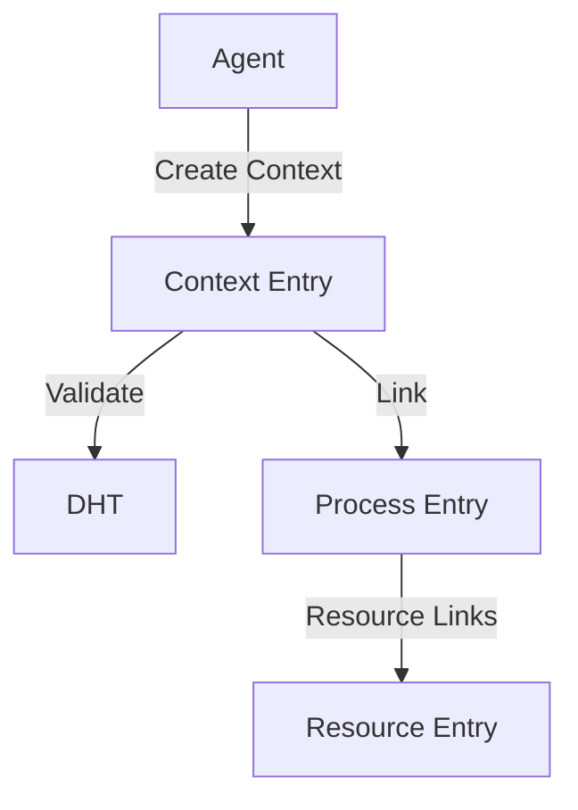

# System Architecture

## Overview
The Holochain Network Resource Planning 2.0 system is built on Holochain's distributed architecture, implementing a peer-to-peer network for resource planning and contribution tracking.

## Core Components

### 1. DNA Structure
```
nrp2_dna/
├── zomes/
│   ├── context/
│   │   └── lib.rs      # Context management
│   ├── process/
│   │   └── lib.rs      # Process handling
│   └── resource/
│       └── lib.rs      # Resource management
└── dna.yaml
```

### 2. Entry Types
```rust
#[unit_enum(UnitDefIndex)]
pub enum EntryTypes {
    Resource(Resource),
    Context(Context),
    Process(Process),
}
```

## Data Flow

### 1. Context Management


### 2. Process Flow


## Component Interactions

### 1. Entry Relations
- Contexts contain Processes
- Processes manage Resources
- Resources link to Locations
- All entries maintain version history

### 2. Validation Flow
1. Entry Creation
   - Schema validation
   - Permission checks
   - Link validation

2. Updates
   - Version control
   - Change tracking
   - Status updates

## Technical Implementation

### 1. Core Functions
- Context management
- Process tracking
- Resource allocation
- Status updates
- Version control

### 2. Data Storage
- DHT-based storage
- Local chain validation
- Peer validation
- Data redundancy

## Security Architecture

### 1. Access Control
- Capability-based security
- Role-based permissions
- Context-specific access

### 2. Data Protection
- Entry validation
- Link verification
- Update control
- Version tracking

## Network Architecture

### 1. P2P Network
- DHT-based routing
- Node discovery
- Data synchronization

### 2. Data Distribution
- Redundant storage
- Validation rules
- Conflict resolution
