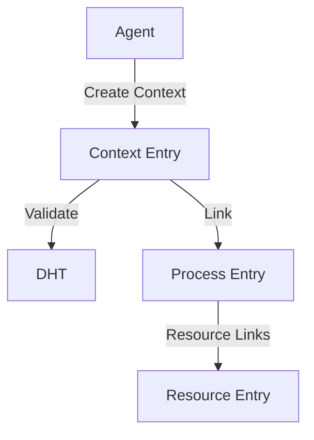
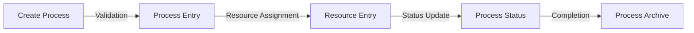
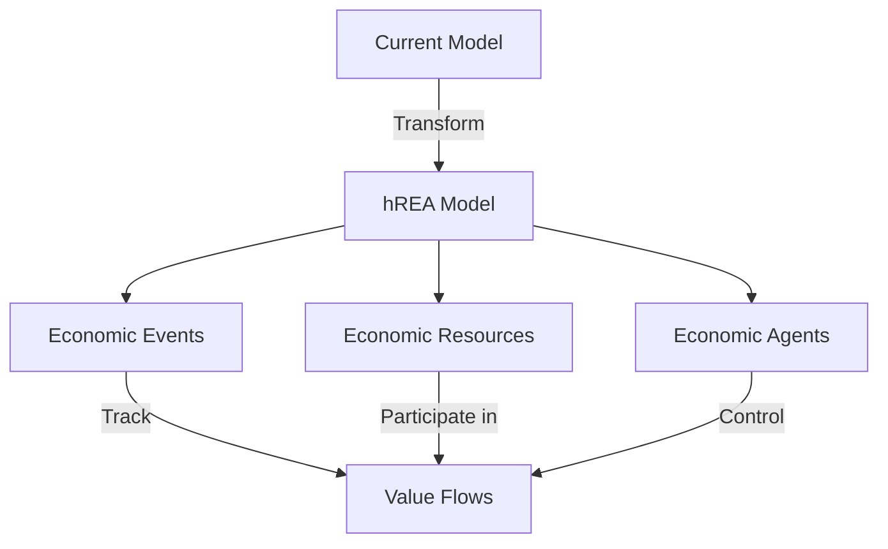

# System Architecture

## Overview

The Holochain Next-Gen Network Resource Planning system is built on Holochain's distributed architecture, implementing a peer-to-peer network for resource planning and contribution tracking.

## Core Components

### 1. DNA Structure

```
next_gen_nrp_dna/
├── zomes/
│   ├── context/
│   │   └── lib.rs      # Context management
│   ├── process/
│   │   └── lib.rs      # Process handling
│   └── resource/
│       └── lib.rs      # Resource management
└── dna.yaml
```

### 2. Entry Types

```rust
#[unit_enum(UnitDefIndex)]
pub enum EntryTypes {
    Resource(Resource),
    Context(Context),
    Process(Process),
}
```

## Data Flow

### 1. Context Management



### 2. Process Flow



## Component Interactions

### 1. Entry Relations

- Contexts contain Processes
- Processes manage Resources
- Resources link to Locations
- All entries maintain version history

### 2. Validation Flow

1. Entry Creation
   - Schema validation
   - Permission checks
   - Link validation

2. Updates
   - Version control
   - Change tracking
   - Status updates

## Technical Implementation

### 1. Core Functions

- Context management
- Process tracking
- Resource allocation
- Status updates
- Version control

### 2. Data Storage

- DHT-based storage
- Local chain validation
- Peer validation
- Data redundancy

## Security Architecture

### 1. Access Control

- Capability-based security
- Role-based permissions
- Context-specific access

### 2. Data Protection

- Entry validation
- Link verification
- Update control
- Version tracking

## Network Architecture

### 1. P2P Network

- DHT-based routing
- Node discovery
- Data synchronization

### 2. Data Distribution

- Redundant storage
- Validation rules
- Conflict resolution

## hREA Implementation Plan

### 1. Core REA Concepts

- **Economic Events**: Transactions and activities that affect resources
  - Contributions
  - Resource transfers
  - Service provisions
- **Economic Resources**: Tracked items and services
  - Material resources
  - Immaterial resources
  - Capabilities
- **Economic Agents**: Participants in the network
  - Individual contributors
  - Organizations
  - Projects/Ventures

### 2. ValueFlow Integration

- **Value Flows**:
  - Input/Output flows
  - Transfer flows
  - Transformation flows
- **Planning**:
  - Commitments
  - Intents
  - Agreements

### 3. Data Model Transformation



### 4. Implementation Phases

1. **Phase 1: Core hREA Structure**
   - Implementation of basic REA entities
   - Migration of existing data model
   - Basic ValueFlow patterns

2. **Phase 2: Advanced Features**
   - Complex value flows
   - Planning and commitment system
   - Advanced resource tracking

3. **Phase 3: Integration**
   - ValueFlow network compatibility
   - Cross-network resource tracking
   - Standardized API implementation
